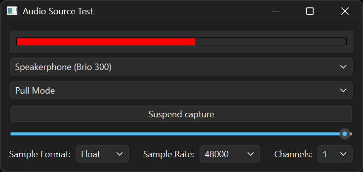

# Audio Source Example

Recording audio using the QAudioSource class.

Audio Source demonstrates the basic use cases of `QAudioSource`.

Qt provides the `QAudioSource` class to enable audio functionality within a standard application user interface.

This example calculates the maximum linear value of the input audio from the microphone and displays the output. The UI allows the user to select the audio input device, pause and resume the audio stream, switch between different modes of operation, adjust the volume and change the audio format parameters.

## Running the Example

Run `qtaudiosource` from terminal